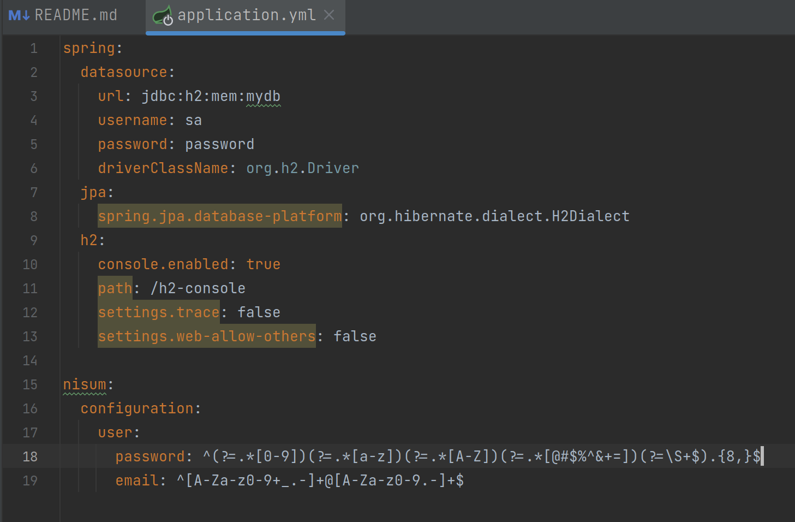
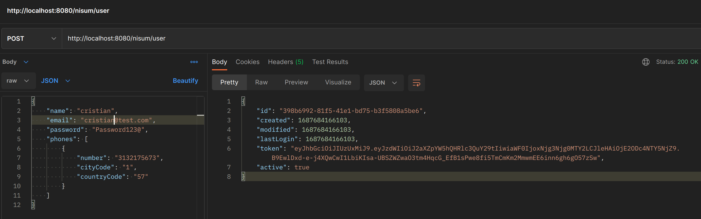
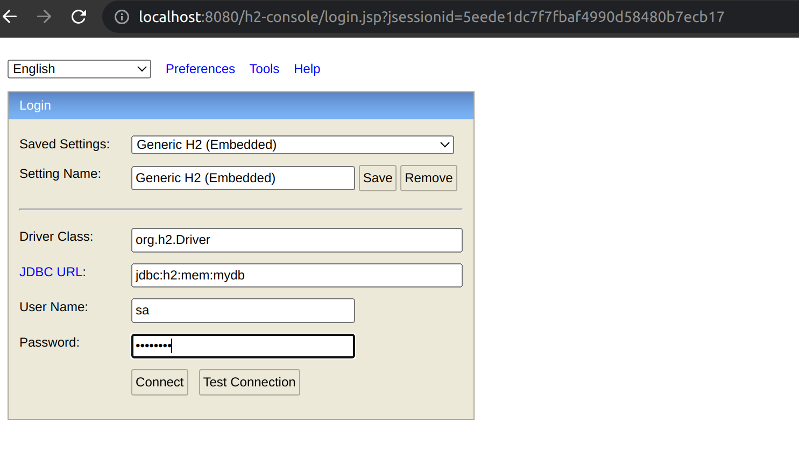
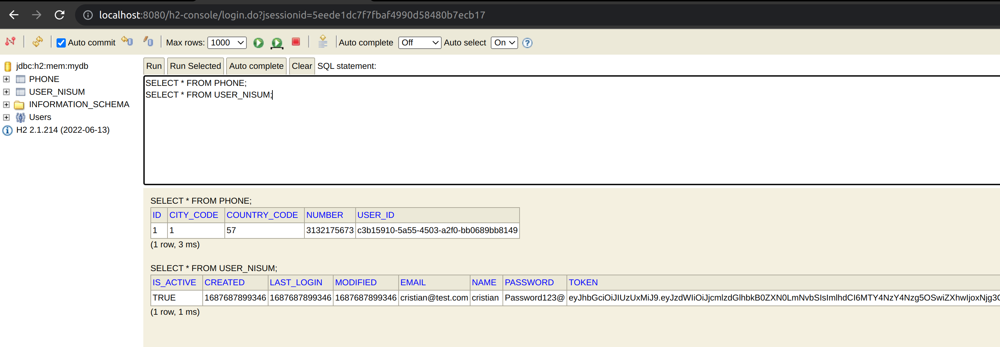

# API Create User Nisum

Esta es una API REST para crear usuarios.

## Tabla de Contenidos

- [Introducción](#introducción)
- [Instalación](#instalación)
- [Uso](#uso)
- [Endpoints](#endpoints)
- [Base de datos](#Database)
- [Autor](#Autor)

## Introducción

La API Nisum creación de usuarios te permite crear registros de usuarios en bd H2 y generando un jwt.

## Instalación

Para ejecutar la API Creación de usuarios, sigue estos pasos:

1. Clona el repositorio: `git clone https://github.com/CristianEPT/nisum-core.git`
2. Navega al directorio del proyecto: `cd nisum-core`
3. Construye el proyecto: `gradle clean build`
4. Ejecuta la aplicación: `java -jar build/libs/nisum-core-0.0.1-SNAPSHOT.jar`

## Uso

Las configuraciones del artefacto las puede encontrar en:

`./nisum-core/src/main/resources/application.yml`

Acá encontrará las configuraciones de la base de datos y las configuraciones de las expresiones regulares, recuerde
modificarlas antes de correr el artefacto.

Una vez que la API esté en funcionamiento, puedes enviar solicitudes HTTP al endpoint disponible para registrar
usuarios.

## Endpoints

El swagger de la api lo encontrara aqui [swagger.yml](#swagger.yml)

La API usuarios proporciona los siguientes endpoints:

- `POST /nisum/user`: Crea un registro en base de datos y retorna información del usuario.

desde un terminal puede ejecutar el siguiente curl

`curl --location --request POST 'http://localhost:8080/nisum/user' \
    --header 'Content-Type: application/json' \
    --data-raw '{
        "name": "cristian",
        "email": "cristian@test.com",
        "password": "Password123@",
        "phones": [
            {
                "number": "3132175673",
                "cityCode": "1",
                "countryCode": "57"
            }
        ]
    }'`

o desde postman, de la siguiente manera

## Database

Las configuraciones de la base de datos se encuentran en el archivo `properties.yml`. Asegúrate de proporcionar las
configuraciones correctas antes de ejecutar la aplicación.

Una vez se ejecute el proyecto la base de datos se va a habilitar y podra acceder de manera grafica por http://localhost:8080/h2-console

Se le solicitaran credenciales tales como se muestran a continuación

Una vez ingrese y ya hubiese creado usuarios podra ejecutar los siguientes selects para ver los datos persistidos

## Autor

Este archivo README.md fue creado por [Cristin Piña](https://github.com/CristianEPT).
